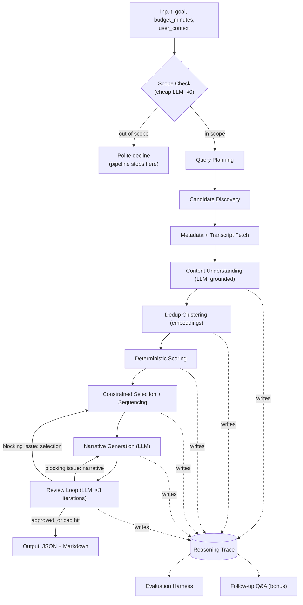

# Learning Curriculum Builder — High-Level Design

Companion to `APPROACH.md` (read that first for the reasoning behind these
choices). This document is the system design: pipeline, data contracts,
algorithms, evaluation, test set, cost model, repo layout, and build order.
No code yet.

---

## 0. Scope check (guardrail)

Before anything else runs: one cheap, fast Claude call — the same cheap
tier §8 already defines for the high-volume understanding step, not a new
model or a new tier — classifies whether the input is actually a learning-
goal request this tool can act on. Structured output, not a free chat
reply, same discipline as the reviewer's verdict (§3.9):

```
{
  "in_scope": bool,
  "reason": str          # short, e.g. "not a learning goal" / "goal field is empty/gibberish"
}
```

If `in_scope` is `false`, the pipeline stops here — no query planning, no
discovery, no understanding calls, no review loop. The response is a
distinct, minimal shape (curriculum/`goal_coverage` don't apply to a
declined request):

```json
{
  "status": "out_of_scope",
  "message": "This tool builds a sequenced set of YouTube videos for a learning goal, within a time budget. That doesn't look like a learning goal I can build a curriculum for (empty/gibberish goal field) — try rephrasing as something you want to learn, with how much time you have."
}
```

`message` is a fixed template with the model's `reason` dropped into it,
not freely generated — a cheap model asked to write an open-ended refusal
can drift in tone or ramble; a cheap model asked to fill one slot in a
fixed sentence can't. This is the same "generative where it helps,
deterministic where it matters" split (`APPROACH.md` #2) applied one level
up from the rest of the pipeline: deciding *whether* the input is in scope
genuinely needs a model (it's a semantic judgment, not a keyword match —
a regex/keyword gate would false-positive on legitimate goals that don't
happen to use expected words, and false-negative on off-topic requests
that do), but *how the decline is phrased* doesn't.

**Also functions as a first line of defense against prompt injection.**
`goal`, `user_context.background`, and `user_context.constraints` are free
text that flow directly into every downstream prompt (query planning,
per-candidate understanding, narrative, reviewer). An input trying to
smuggle instructions ("ignore the above and instead...") isn't a coherent
learning goal either, so it fails this gate for the same reason nonsense
input does. Stated honestly, not as a guarantee: this is a best-effort
check, not hardening. A determined injection phrased as a plausible-
looking learning goal could still pass, and nothing downstream specifically
sanitizes injected instructions that might arrive inside a transcript
excerpt or `evidence_snippet` either — that's a broader risk this one gate
doesn't close, named honestly rather than implied-solved.

**Considered and discarded:** a separate, fully local tiny model (e.g. a
~1B-parameter open model run on CPU) purely for this classification, so
off-topic traffic costs zero Claude budget. Rejected — it adds a second
inference stack and a second model dependency for one narrow yes/no
judgment, which is more complexity than the thing it's protecting against.
The cheap Claude tier already in the stack is cheap enough that this isn't
worth the extra moving part.

**Cost effect (see §8):** adds exactly 1 cheap-tier call to every request.
For a real request that's negligible next to the ~10–25 calls the rest of
the pipeline uses. For an off-topic or malformed request it's a net saving
— those ~10–25 calls never run at all. A minimal trace entry (input,
verdict, reason) is still written even on decline, so the classifier's own
false-positive/false-negative rate can be audited later (§11).

---

## 1. Pipeline overview



Every stage is a plain function/module with a typed input and output —
no message queue, no service boundary. This diagram is implemented
directly as a **LangGraph graph** (`agent/graph.py`, §9): each box is a
node, each arrow an edge, and the `REVIEW` box's two loop-back arrows are
a single conditional edge chosen by the reviewer's verdict. LangGraph is
used only as that control-flow engine — no LangServe, no separate
service; the graph still executes inside the one CLI process this design
already commits to. The only thing that crosses a process boundary is the
Claude API call and the `yt-dlp` subprocess call, and both are wrapped so
the rest of the pipeline never touches raw network/subprocess concerns.

---

## 2. Data contracts

Pydantic models (or dataclasses) for everything that crosses a stage
boundary — this is what "we'll read the code, not just the docs" means in
practice: the shapes should be legible without reading the implementation.
These same models compose into the single state object that flows through
`agent/graph.py`'s LangGraph nodes (§1) — the graph doesn't define its own
separate shapes; it accumulates exactly these contracts as it runs.

### 2.1 Input (matches the brief's persona schema exactly)

```json
{
  "persona_id": "weekend_react_dev",
  "goal": "Build a small React app this weekend, something like a habit tracker with local storage",
  "time_budget_minutes": 360,
  "user_context": {
    "background": "Python backend engineer, 5 years experience",
    "known": ["JavaScript fundamentals", "HTTP, REST, JSON", "Git, npm"],
    "unknown": ["React", "JSX", "Vite tooling", "React hooks", "Component patterns"],
    "constraints": "I prefer project-based content. Avoid pure-theory lectures and 'in 100 seconds' surface intros."
  }
}
```

### 2.2 Candidate (post-discovery, pre-understanding)

```
video_id, title, channel, url, duration_minutes,
upload_date, description, transcript_available: bool
```

### 2.3 Understanding record (per candidate, from the grounded LLM pass)

```
video_id,
covers_topics: [str],          # what it actually teaches, in the video's own terms
primary_style: "project-based" | "theory-lecture" | "quick-intro" | "reference-walkthrough",
depth: "surface" | "intro" | "intermediate" | "advanced",
phase: "setup" | "concept" | "hands-on-project" | "advanced-followup",  # pedagogical role, used for sequencing (§4)
matches_unknown: [str],          # subset of user_context.unknown this addresses
overlaps_known: [str],           # subset of user_context.known this mostly re-teaches
constraint_violations: [str],    # e.g. ["surface_intro"] if user asked to avoid that
evidence_snippet: str,            # short quote/paraphrase from the transcript backing the above
grounded: bool,                    # true iff based on transcript, false if metadata-only fallback
confidence: float,                 # 0-1, lower when grounded=false or transcript is thin/garbled
quality_signal: {
  clarity: float,                    # 0-1: builds concepts in order / stays on topic, read off transcript structure
  content_density: float,            # 0-1: estimated fraction of runtime that's actual instruction, not sponsor/filler/rambling intro
  accuracy_flags: [str]              # speculative, low-confidence notes only -- e.g. an API usage that looks outdated. Never treated as verified fact-checking.
}
```

`quality_signal` is a distinct axis from everything above it — the rest of
this record answers "is this the right content for this learner," this
answers "is the content itself any good," and the two can disagree (a
perfectly on-topic video can still be a rambling, low-density explanation).
It's produced in the same LLM call as the rest of the record — no extra
call, no extra cost — because it's read off the same transcript. See §6.4
for what it deliberately can't tell you.

`phase` is classified the same way, in the same call, for the same reason
`primary_style` and `depth` are: "is this foundational setup/tooling
content, a concept explainer, an integrated hands-on build, or an advanced
extension beyond the core ask" is a semantic read of the transcript, not
something derivable from `matches_unknown` strings alone — the persona's
`unknown` list (§2.1) is a flat list with no inherent prerequisite order
("Vite tooling" isn't marked as coming before "Component patterns"
anywhere in the input). This is what §4 step 4 actually sorts by; see §11
for the risk this introduces (it's now a judgment call, not deterministic
code).

### 2.4 Scored candidate (post dedup + scoring, pre-selection)

Adds to the above: `cluster_id` (dedup group) and `utility` (the composite
score used by the selection algorithm — see §4). `phase` carries straight
through unchanged from §2.3 — it's classified once, during understanding,
not recomputed here.

### 2.5 Output (final curriculum)

```json
{
  "persona_id": "weekend_react_dev",
  "budget_minutes": 360,
  "total_minutes": 347,
  "curriculum": [
    {
      "order": 1,
      "video_id": "...",
      "title": "...",
      "url": "https://youtube.com/watch?v=...",
      "duration_minutes": 42,
      "reason": "Covers Vite project scaffolding and dev server config end to end, hands-on — the exact 'Vite tooling' gap listed, and matches the project-based preference.",
      "evidence_snippet": "...",
      "confidence": 0.86,
      "grounded": true
    }
  ],
  "review": {
    "iterations": 1,
    "approved": true,
    "unresolved_blocking_issues": []
  },
  "considered_and_dropped": [
    {
      "video_id": "...",
      "title": "...",
      "reason_dropped": "Covers the same Vite setup as pick #1, ~90% topic overlap (cluster c3); pick #1 scored higher on depth and had a cleaner transcript match.",
      "would_have_ranked": 2
    }
  ],
  "warnings": [],
  "goal_coverage": {
    "React": "covered", "JSX": "covered", "Vite tooling": "covered",
    "React hooks": "covered", "Component patterns": "partially covered"
  }
}
```

`warnings` is where infeasibility gets surfaced honestly — e.g.
`"budget too small to responsibly cover this goal; curriculum addresses a scoped-down subset — see notes"`
rather than forcing an artificial video count into a budget that doesn't
support it. `review.iterations` is
almost always `1` — see §3.9; a value >1 means the draft needed at least
one revision before shipping, and if `unresolved_blocking_issues` is
non-empty, those same issues are copied verbatim into `warnings` too, never
left only in a field a casual reader of the Markdown render would miss.

### 2.6 Reasoning trace (persisted per run, superset of everything above)

One JSON file per run: input, every discovered candidate, every
understanding record (including ones never selected), the dedup clusters,
every score, the selection algorithm's intermediate state (what was in the
running set at each step and why something was swapped out), **every review
iteration** (§3.9 — the reviewer's verdict, the issues it raised, and what
changed in response to each one), and the final output. This is the
artifact the eval harness and the follow-up Q&A both read — nothing about
evaluation or Q&A requires re-running discovery or re-calling the LLM, and a
"why does pick #2 look like this" follow-up can now answer honestly with
"it was swapped in during review, iteration 2" when that's what actually
happened, instead of describing only the final state as if it were decided
once.

---

## 3. Stage-by-stage design

### 3.1 Query planning

One Claude call: given `goal` + `user_context`, produce 4–5 targeted search
queries — one per `unknown` item where that makes sense, plus one or two
phrased around the goal itself (e.g. for the reference persona: `"Vite React
setup tutorial"`, `"React hooks tutorial project"`, `"build habit tracker
react local storage"`). Decomposing by `unknown` item, rather than searching
the goal alone, is what surfaces prerequisite/setup content instead of only
capstone-project videos.

### 3.2 Candidate discovery

`yt-dlp` search (`ytsearch40:<query>`) per planned query, flat-extracted
(cheap — no per-video download). Merge and dedupe by `video_id` across
queries, round-robin by rank across queries and hard-capped at
`MAX_TOTAL_CANDIDATES = 40` (`agent/discovery.py`) so the expensive stages
below always see a bounded, predictable volume regardless of how many raw
results a fan-out of 4–5 queries × 40 results/query produces.

Cheap pre-filters, no LLM involved: drop videos over the full budget on
their own, drop live streams/shorts under ~90 seconds, drop non-target-
language if a language constraint is given, drop obvious non-matches by a
lightweight keyword check. This is what keeps the expensive stages (3.4
onward) from having to look at hundreds of clearly-irrelevant candidates.
Target: filter down to ~40 before understanding.

### 3.3 Metadata + transcript fetch

`yt-dlp` again, per surviving candidate, for real metadata (duration,
description, upload date) — download-free, as below. The transcript itself
comes from `youtube-transcript-api` (SKILLS.md #15) rather than yt-dlp's own
caption-URL indirection; `transcript_available` is set either way. If long,
the transcript is down-sampled to an even spread across the video rather
than truncated from the start — a 90-minute tutorial's last third matters
as much as its first.

**This entire stage is download-free, as a hard constraint, not an
implementation detail.** Discovery (§3.2) and this step call `yt-dlp`
exclusively in its no-download modes: `extract_info(download=False)` for
search and metadata, and `skip_download=True` with
`writesubtitles`/`writeautomaticsub` for captions. Video and audio bytes
are never fetched anywhere in this pipeline. This is why the cost model
(§8) has no line item for media processing, and why nothing here needs
local disk space proportional to video length — a run's storage footprint
is metadata and text (captions, transcripts, the trace), regardless of how
many hours of video it evaluated.

### 3.4 Content understanding (the grounding step)

Batched Claude calls (e.g. 5 candidates per call to hold down call count),
each producing the structured understanding record from §2.3, conditioned
on the actual transcript excerpt (or, if unavailable, explicitly told it
only has metadata — this is what sets `grounded: false` and depresses
`confidence`). This is the step that answers the brief's actual hard
problem: not "does this look relevant" but "what does this video actually
teach, at what depth, in what style." It also classifies `phase` here —
the pedagogical role each candidate plays (setup, concept, hands-on
project, advanced-followup) that §4 later sequences by — since it's the
same kind of read of the transcript as `primary_style`/`depth`, not a
separate signal that needs its own pass.

### 3.5 Dedup clustering

Embed each candidate's `covers_topics` + style/depth summary with a
hosted proprietary embedding model over OpenRouter (`openai/
text-embedding-3-small`, same client/key as every chat call — see
`agent/llm_client.call_embeddings`). Cluster by cosine-similarity
threshold (simple union-find over pairs above the threshold — no need
for a clustering library at this candidate count). Videos in the same
cluster are treated as substitutes for each other in selection, not as
independent coverage.

Originally a small local sentence-embedding model (`all-MiniLM-L6-v2` —
free, offline, no extra API calls) — swapped after a local Docker build
spent >20 minutes on torch alone for what amounts to embedding a few
dozen short strings per run. See SKILLS.md #14 for the full reasoning,
the live threshold recalibration (0.82 → 0.84, a different model's
embedding space), and the one real bug the swap surfaced (the hosted
endpoint hard-rejects empty-string input where the local model silently
tolerated it).

### 3.6 Deterministic scoring

Composite utility per candidate — pure arithmetic, no LLM:

```
utility = base_relevance
          * (1 − known_overlap_penalty)
          * (1 − constraint_violation_penalty)
          * confidence
          * quality_multiplier
          + novelty_bonus(cluster_id)

quality_multiplier = clarity * content_density
```

where `base_relevance` comes from how many distinct `unknown` items a
candidate's `matches_unknown` covers (with diminishing returns for
re-covering an item another strong candidate already covers), and
`novelty_bonus` rewards being the strongest representative of its dedup
cluster (and only that one — see §4).

`accuracy_flags` is **not** folded into `quality_multiplier` as a silent
penalty — it's speculative, not verified, and quietly downranking a video
on an unconfirmed hunch is worse than surfacing the hunch. Instead, any
candidate with a non-empty `accuracy_flags` that still gets selected
carries that flag through to the output's `warnings` (§2.5), so a human
reads it rather than never seeing it.

Deliberately excluded from `utility`: view count, like count, subscriber
count, recency. See §6.5 for why, and how they're still used (as tie-breakers
only, never as scoring inputs).

### 3.7 Constrained selection + sequencing

Detailed in §4 — this is the core algorithmic piece, not the LLM's job.

### 3.8 Narrative generation

One final Claude call, given the *already-decided* selected set, the
runner-ups in each cluster that lost, and their scores/evidence snippets.
The model's job here is to phrase — write the human-readable `reason` for
each pick grounded in its `evidence_snippet`, and write `reason_dropped` for
notable runner-ups (especially same-cluster ones, which is exactly where the
brief asks "why two similar videos shouldn't both make the cut"). The model
is explicitly not asked to re-decide anything; it's narrating a decision
it's given, which is what keeps the reasons tied to real scores instead of
being a plausible-sounding post-hoc story. This produces a **draft**, not
the final output — see §3.9. The narrator itself still never revises its
own work unprompted; if a rewrite happens, it's because the reviewer sent a
specific, structured instruction back to this same stage, not because the
narrator second-guessed itself.

### 3.9 Review loop (reviewer agent)

This is the "initial final outcome gets reviewed until the reviewer is
satisfied" piece: a second Claude call, prompted with a distinct role from
the builder/narrator, given the full draft curriculum (picks, order,
reasons, evidence snippets), the persona/goal/budget, and the same
deterministic metrics already computed for this run (§6.1's checks —
budget compliance, coverage, redundancy, grounding rate). It answers one
question: is this draft good enough to ship, and if not, specifically why.

**Output is a structured verdict, not prose:**

```
{
  "approved": bool,
  "issues": [
    {
      "severity": "blocking" | "minor",
      "stage_to_fix": "selection" | "narrative",
      "target": "<video_id>" | "overall",
      "issue": str,
      "suggested_fix": str
    }
  ]
}
```

**Anchored on deterministic checks, not vibes.** Before the reviewer's LLM
call even runs, any failure of §6.1's automated metrics on this specific
draft (budget overage — should be structurally impossible per §4, so this
would indicate a bug; an uncovered `unknown` item that a discovered
candidate could have filled; redundancy above the dedup threshold) is
injected as an automatic `blocking` issue. The LLM's own judgment can only
*add* issues on top of that (a `reason` that doesn't actually cite its
`evidence_snippet`, sequencing that doesn't read sensibly, a pick with a
low `quality_signal` relative to a same-cluster runner-up) — it cannot
dismiss or override a deterministic failure. This is the same
"deterministic where it matters, generative where it helps" principle
(`APPROACH.md` #2) applied to the reviewer itself: a reviewer that's pure
LLM judgment can be talked out of a real defect by fluent prose, which
would make the whole loop reward better *writing* instead of a better
*answer*.

**Feedback routing.** Each blocking issue's `stage_to_fix` says what
re-runs, and only that:

- `"narrative"` → §3.8 re-runs, for the flagged pick(s) only — a cheap,
  targeted rewrite (e.g. "pick #3's reason restates the title; it doesn't
  cite anything from `evidence_snippet`").
- `"selection"` → §3.6/§3.7 re-run with the flagged candidate penalized or
  excluded, reselecting from the **already-discovered, already-understood**
  candidate pool. This never triggers new discovery or new understanding
  calls (§3.2–3.4 don't re-run) — the reviewer critiques what was already
  found; it doesn't go looking for more.

**Termination — a concrete stopping condition, not "until satisfied":**
capped at **3 iterations**, hardcoded. In the LangGraph implementation
this is a conditional edge out of `REVIEW`: its routing function reads a
`review_iterations` counter carried in graph state, and only takes the
loop-back edge (to `NARR` or `SEL`, per `stage_to_fix`) while `approved`
is false, `issues` has a `blocking` entry, *and* the counter is below 3;
otherwise it routes to `OUT`. This counter, not LangGraph's generic
`recursion_limit`, is what actually enforces the product-level cap —
`recursion_limit` is set generously above the normal step count purely as
a safety net against a genuinely broken graph (e.g. an edge-routing bug
that loops forever), never relied on as the mechanism that bounds cost.
The loop ends early, usually after iteration 1, as soon as `approved` is
true or `issues` has no `blocking` entries left. If the cap is reached
with blocking issues still open, the run ships anyway — every remaining
blocking issue is copied verbatim into the output's `warnings` (§2.5).
This is the same honesty pattern as §4 step 3's infeasible-budget
handling, applied to a different failure mode: be plain about an
unresolved limit rather than either loop indefinitely (a real
cost/usage-cap risk — §8) or silently ship something the reviewer flagged
and hope nobody checks the trace.

**Not a second quality system.** This reuses §6.2's LLM-as-judge rubric —
factored into one shared module (`agent/critique.py`, §9) rather than two
independently-written "is this good" prompts. The judge calls it offline,
in batch, over the test set, 3× for variance, to grade the system as a
whole; the reviewer calls it online, once per real run (up to 3×), to gate
what ships that run. Same underlying question, two call sites — which also
means the same blind spot applies twice: reviewer approval is evidence the
narrator and reviewer *agree*, not proof either is *correct*, since both
are Claude calls (§6.4 notes this explicitly).

**Why this doesn't become the over-engineering `APPROACH.md` #5 warns
against:** no new infrastructure — it's one conditional edge in the same
in-process LangGraph graph every other stage already runs in, not a
separate orchestration layer, queue, or service. No new "judgment" logic
(it's §6.2's rubric, reused). And a hard, small iteration cap tied
directly to the usage-cap concern already in §8/§11, enforced by an
explicit counter this design controls, not by trusting a framework
default to happen to bound it correctly. The complexity budget went into
making the loop *bounded and anchored*, not into making it elaborate —
LangGraph changes how the loop is wired, not what it's allowed to do.

### 3.10 Output rendering

Same trace → JSON (§2.5) and a Markdown render for humans. One source of
truth, two views.

---

## 4. Selection algorithm, in detail

`budget` here is `time_budget_minutes` from the Input contract (§2.1) —
taken as-is from the persona, never adjusted. It's treated as a **hard
ceiling, not a target**: the algorithm will never let `total_minutes`
exceed it, but landing under it is normal and expected, not a defect. The
brief's own sketch does this — ~5 hours of picks against a 360-minute
(6-hour) budget — because forcing an exact fit would mean either padding
with a lower-utility video just to use up remaining minutes, or trimming a
good pick down to a worse one that happens to fit better. Neither is worth
it for closing the last 10–15% of a budget.

Framed as a coverage-weighted knapsack, solved with greedy + bounded local
search rather than an ILP solver — at 40–80 candidates this is simple,
fast, and easy to explain in a README, which matters more here than
provable optimality:

**No target video count anywhere in this algorithm.** The brief's own
reference sketch happens to land on 4–6 videos for its example persona —
that's a property of *that* persona's goal and budget, not a constraint
on the agent. A narrow goal with a tight budget can validly produce two
picks; a broad goal with a generous budget can validly produce ten. Count
is an outcome of coverage and budget, never a number the algorithm aims
for. Concretely:

1. **Greedy pass.** Sort candidates by `utility / duration_minutes`
   (bang-per-minute). Walk down the list, adding a candidate if it fits
   the remaining budget (`time_budget_minutes` minus the sum of durations
   already picked) and its cluster isn't already represented by a
   higher-utility pick already in the set. Stop when either the remaining
   budget can't fit anything left, *or* every remaining candidate that
   would fit is redundant — adds no still-uncovered `unknown` item and
   doesn't out-score an already-picked cluster-mate. There is no count
   cap: the pass keeps adding genuinely non-redundant, budget-fitting
   candidates for as long as any exist, and stops the moment none do —
   not at a fixed number.
2. **Coverage check.** If any `unknown` item is still uncovered and a
   candidate that covers it would fit by dropping the current
   lowest-utility pick, make that swap (bounded: at most a few such swaps,
   not a search over all subsets).
3. **Infeasibility check.** If the budget can't fit even one candidate
   with meaningful utility, or the best achievable set under budget still
   leaves most of `unknown` uncovered, do not pad with low-utility filler
   just to produce *something* — see §6's "infeasible budget" handling.
   There is no minimum pick count to hit either: a single well-justified
   video that honestly covers what a tight budget allows is a valid
   output, not a failure to reach a floor.
4. **Sequencing.** Order the final set by `phase` (`setup → concept →
   hands-on-project → advanced-followup`, classified per-candidate during
   understanding — §3.4/§2.3, not computed here), tie-broken by `utility`
   descending within a phase. This directly implements the sketch's
   "starting with React/Vite setup, then a project-build tutorial." This
   is a deliberate simplification, not a full dependency solve: it orders
   by broad pedagogical stage, not by fine-grained prerequisites between
   specific videos (e.g. a project video assuming the exact setup steps
   another specific video covered) — stated as a limitation, not silently
   assumed away.

This whole step is unit-testable without any LLM or network call: feed it
synthetic scored candidates, assert on which subset and order comes out.
That's deliberate — the one part of the pipeline that must be *correct*,
not just *plausible*, is written so correctness is checkable directly.

---

## 5. Reasoning trace & follow-up Q&A (bonus)

### 5.1 Follow-up Q&A mechanism

Because §2.6's trace already contains every candidate, its score, its
cluster, and why it lost, "why didn't you include video X" (bonus ask) is
answered by: look up X in the trace (by `video_id` or fuzzy title match) →
if it exists, its score breakdown and `reason_dropped`/cluster-mate
explanation are already computed, so answering is a small Claude call that
phrases the existing structured record, not a new retrieval or a new
judgment call → if X was never discovered at all, say so plainly rather
than guessing why. No architecture is added for this beyond keeping the
trace around; it's a read path over data the main run already produced.

### 5.2 Streamlit front-end

**Trigger (explicit request):** a UI to "chat with the output" — ask things
like "why was this video skipped" interactively instead of re-invoking the
CLI per question.

This is a presentation layer over §5.1, not a new capability. `ui/app.py`
imports `run.py`'s pipeline entrypoint and `agent/followup.py` directly — it
adds no new prompts, no new pipeline stage, and no new judgment logic. Three
things happen in it, all thin wrappers over what already exists:

1. **Run or load.** A form for `goal` / `time_budget_minutes` /
   `user_context` (or a picker over `/test_set/`'s existing scenario files),
   plus a toggle for `enable_reviewer` (§6.6) — calling `run.py`'s pipeline
   function in-process, synchronously, with a spinner while it runs. This is
   a direct function call, not a subprocess shell-out and not a queued job;
   Streamlit's single-session model is exactly the "one process, no
   concurrent consumer" scope this whole design already commits to
   (`APPROACH.md` #5). Alternatively, browse `outputs/` and load a
   previously-computed trace with no new run at all.
2. **Render.** The same `render.py` Markdown, displayed directly — no second
   templating path for the UI.
3. **Chat.** A chat box wired to `agent/followup.py` (§5.1) against whichever
   trace is currently loaded. "Why was video X skipped" and "why is pick #2
   ordered before pick #1" are both already-answerable lookups into the
   trace; the UI doesn't add anything the CLI-driven bonus ask couldn't
   already do, it just makes asking a second and third question free of
   re-invoking a command.

**What this deliberately doesn't do:** no accounts, no multi-user session
isolation, no server-side state beyond the local `outputs/` directory and
cache already defined in §8/§9. It's a single-user local tool, same as the
CLI, wearing a different front end — not a step toward the 10K-users/day
deployment that stays on-paper-only per `APPROACH.md`'s non-goals. The CLI
remains the primary, always-available interface; the UI is additive, not a
replacement path that the eval harness or grading depends on.

---

## 6. Evaluation design

This is the deliverable the brief says it reads most carefully, so it gets
the most detail here.

### 6.1 Automated, reference-free metrics (run against every test-set scenario)

Budget compliance is graded asymmetrically, not with a symmetric ±X%
tolerance: §4's algorithm already makes overage structurally impossible,
so any overage is a hard fail (it means the selection code has a bug, not
that it made a debatable call). Undershooting is graded loosely — the
brief's own reference sketch lands ~17% under a 360-minute budget (~5
hours picked), so anything tighter than that would flag the brief's own
example as a failure. ~25% under is treated as fine; something like 50%
under (padding out four low-utility picks instead of finding five better
ones, or worse, only surfacing two decent videos) is a real signal that
discovery or scoring came up short, not that the agent was being
appropriately conservative.

| Metric | What it checks | How |
|---|---|---|
| Budget compliance | Never over (hard fail if so); under by no more than ~25% (looser below that — see above) | Arithmetic on the output |
| Curriculum shape sanity | No fixed count target (§4) — checks the pick count is a plausible *outcome*: not zero when feasible candidates existed, not fragmented into many low-utility short clips when better coverage was achievable, not one video consuming the whole budget while leaving most of `unknown` uncovered when a better split existed — *or* an explicit, honest infeasibility warning | Arithmetic + presence of `warnings` |
| Unknown-topic coverage | Fraction of `user_context.unknown` addressed by ≥1 pick | Cross-checked two independent ways: (a) the LLM's own `matches_unknown` claim, (b) embedding similarity between the topic string and the video's transcript, computed independently of the LLM's self-report. Disagreement between (a) and (b) is itself logged, not discarded — see 6.4. |
| Known-topic leakage | Picks shouldn't be primarily re-teaching what the learner already knows | `overlaps_known` aggregated across picks |
| Constraint compliance | Picks shouldn't violate stated constraints (e.g. "no theory," "no 100-seconds intros") | Cross-checked against a cheap independent heuristic (duration/title pattern for "surface intro"-style content) so the metric isn't just trusting the same LLM that made the pick |
| Redundancy | No two selected videos are near-duplicates | Max pairwise embedding similarity among picks, should sit below the dedup threshold used in §3.5 |
| Grounding rate | Fraction of picks whose `evidence_snippet` is a verifiable substring/near-match of the actual transcript | Automated string/fuzzy match against the stored transcript — this is the metric that most directly checks "grounded in actual content, not metadata" |
| Sequencing sanity | Setup/foundational picks appear before advanced/project picks | Check `phase` ordering in the output |
| Content quality | Average `clarity`/`content_density` of picks isn't systematically lower than the candidate pool's average | Compares picked-set vs. full-candidate-pool `quality_signal` — catches the failure mode where the algorithm optimizes topic-fit so hard it happily selects a rambling, low-density video over a clearer one covering the same gap. This metric is explicitly a proxy for a proxy (§6.4) — it checks the pipeline is internally consistent with its own quality read, not that the read is correct. |
| Cost & latency | Tokens, $, wall-clock per run | See §8 |

### 6.2 LLM-as-judge (holistic quality)

A second Claude call — different prompt framing than the builder, told
only the persona and the final curriculum (titles, order, reasons), asked
the same question §3.9's runtime reviewer asks (they share one rubric,
`agent/critique.py`, called in batch here instead of gating one run):
"would following this, in order, within budget, plausibly get this learner
to their goal?" plus asked to independently flag any pick that looks
mismatched. Run 3× per scenario to measure judge variance, not just a
single score.

**Explicitly documented blind spots of this judge**, because trusting it
uncritically would undercut the whole point of the exercise:

- It rewards fluent, confident-sounding reasons regardless of whether
  they're actually grounded — grounding is only checked by 6.1's string
  match, never by asking the judge "is this true," because it can't verify
  that from text alone any better than the builder could.
- It shares the builder's model family and likely some of its biases (e.g.
  a prior toward well-known channels from training data), so judge/builder
  agreement is evidence of *consistency*, not *correctness*.
- It cannot watch the video. Anything about production quality, on-screen
  code matching narration, presenter pacing, or accessibility is
  unverifiable by this or any text-only step.
- It isn't deterministic — hence measuring 3-run variance rather than
  reporting a single number as ground truth.
- It's the same rubric §3.9's runtime reviewer runs against every real
  curriculum before shipping it. That reviewer's `approved: true` is
  therefore evidence the narrator and reviewer *agree*, not independent
  confirmation of quality — agreement between two Claude calls sharing a
  rubric and a model family is a weaker signal than it looks like at first
  glance, and this evaluation should not quietly lean on "the reviewer
  approved it" as if that settled the question the judge is here to ask.

### 6.3 Human calibration

For the reference persona plus 2–3 others, I rate the output myself, blind
to the automated scores, then compare. The report states where human and
automated judgment *disagree* and why — e.g. the coverage metric may count
a topic "covered" from one passing mention, where a human reader wouldn't
call that real coverage. That gap is a documented limitation of the metric,
not something to quietly tighten away before submission.

### 6.4 What this evaluation does *not* tell you

- Whether the video is still available, region-locked, or removed after
  the trace was built.
- Whether auto-captions are accurate — they're frequently wrong on
  jargon-heavy technical narration, and a wrong transcript produces
  confidently-wrong grounding that looks identical to correct grounding in
  every automated check here.
- Anything about real learning outcomes. No human has actually followed a
  generated curriculum and reported back; every metric here is a proxy.
- Whether judge/builder agreement — or reviewer/builder agreement (§3.9
  runs the same rubric online) — reflects real correctness or a shared
  blind spot. See 6.2.
- Whether the *set of candidates discovered* was a good set. Every metric
  here scores the pipeline's choice among what `yt-dlp` search surfaced;
  a systematically bad search step would produce a curriculum that looks
  internally consistent and still be a bad answer to the learner.
- **Whether a video is actually good** in the sense a learner means it —
  well-produced, correctly explained, worth their time. `quality_signal`
  (§2.3) is an LLM's read of the *transcript's* clarity and density, not a
  verified judgment of the video. It can be fooled the same way a human
  skimming a transcript with no audio/video could be: a confident, clearly
  narrated explanation of something *wrong* scores as high-clarity as a
  confident, clearly narrated explanation of something right.
  `accuracy_flags` is explicitly labeled speculative for exactly this
  reason and is surfaced as a warning, never used to silently exclude a
  video. Nothing in this pipeline fact-checks instructional content — that
  would need an independent, authoritative source per topic, which is out
  of scope here.

### 6.5 Signals considered and discarded

- **View count / like count as a relevance signal.** Discarded from
  scoring entirely — the brief states outright that these don't solve the
  problem, and they correlate with production polish more than fit for a
  specific learner. Kept only as a last-resort tie-breaker between two
  candidates that score identically on everything else.
- **Subscriber count / channel authority.** Same reasoning, same
  discard-except-as-tie-breaker treatment.
- **Raw transcript-to-goal embedding similarity as the sole relevance
  score.** Discarded as the *only* signal — it can't distinguish a
  beginner explainer from an advanced deep-dive that both happen to use
  similar words. Kept as one input among several (feeding `base_relevance`
  alongside the LLM's structured `matches_unknown`), never the sole score.
- **Recency.** Mostly discarded — for stable topics, an older video isn't
  worse. Not entirely ignored: for fast-moving framework topics (React,
  Vite) a candidate whose transcript describes since-removed APIs is
  penalized through `constraint_violations`/depth mismatch surfaced by the
  understanding step, not through a blanket recency score.
- **Comment mining.** The brief itself names comments as a scattered
  signal ("skip to 4:30, the first half is fluff" is exactly the kind of
  thing a comment reveals that metadata never will). This is also the most
  direct real *quality* signal available anywhere in this problem — unlike
  `quality_signal` above, a comment saying "the code in this doesn't
  actually run" is third-party and grounded in someone having tried it,
  not an LLM's read of tone. Left out of the base agent as a
  cost/reliability tradeoff — noisy, requires its own relevance-filtering
  problem — and flagged in "what I'd do with more time" as the first bonus
  item, specifically *because* it's the one lever that would close the
  quality gap the rest of this pipeline can't.

### 6.6 Reviewer ablation: comparing the pipeline with and without the review loop

**Trigger (explicit request):** produce two versions of the pipeline — one
without the LLM reviewer/judge in the loop, one with — and compare them the
way the brief's evaluation section asks: surfacing disagreement between the
eval and human judgment, and naming signals considered but discarded.

**What "two versions" means here, concretely.** Not two codebases and not a
branch — one `enable_reviewer: bool` run flag (`--no-reviewer` on the CLI,
the same toggle exposed in the Streamlit UI, §5.2). When it's `false`,
`agent/graph.py` wires `NARR → OUT` directly; the `REVIEW` node (§3.9) never
runs at all — not "runs and is ignored," genuinely zero extra calls, zero
extra latency. This keeps the comparison honest: the two variants differ in
exactly one place (whether §3.9 ran), nothing else about discovery,
understanding, scoring, or selection changes between them.

**How they're compared** — `eval/run_eval.py` gains a `--compare-reviewer`
mode that runs all seven `/test_set/` scenarios (§7) under both settings and
reports, per scenario and in aggregate:

| Axis | What's compared | Reused from |
|---|---|---|
| §6.1 automated metrics | Side by side for both variants — budget compliance, coverage, redundancy, grounding rate, curriculum shape sanity | §6.1, unchanged |
| §6.2 LLM-as-judge score | Both variants' final output independently graded by the same offline judge, 3× each for variance | §6.2, unchanged — the judge doesn't know which variant produced what it's grading |
| §6.3 human calibration | Extended to rate both variants' output on the calibration subset, blind to which is which | §6.3, extended |
| Cost & latency | Call count and wall-clock delta — §8 already estimates the reviewer adds ~1 call typical, up to ~7 worst-case | §8, unchanged |
| **Did the reviewer actually change anything** | For each scenario: did §3.9 raise a `blocking` issue that altered the shipped output (a real catch), or approve the first draft with nothing to fix (ran, cost something, changed nothing)? | New — this is the actual causal signal, everything else is just two scorecards next to each other |

**The honest expectation, stated up front rather than discovered and then
massaged:** on the seven test-set scenarios as designed, most are
*legitimate* inputs the pipeline should handle cleanly on the first pass —
the reviewer is anchored on deterministic checks (§3.9) that selection
already satisfies by construction most of the time. So the likely finding
is that the reviewer approves-on-iteration-1 for most scenarios (cost paid,
output unchanged) and only earns its keep on the scenarios closer to its
actual purpose — scenario 4's deliberately infeasible budget, or a
hand-corrupted draft like the one built in §10 step 9 (duplicate pick,
blown budget). If that's what the data shows, that is the finding, not a
disappointing result to explain away: it's a direct, evidenced answer to
"is this extra call worth its cost," which is exactly the kind of thing
"signals considered but discarded" (§6.5) already tries to model — the
reviewer isn't discarded here, but the report should be equally willing to
say "kept, but its measured value on typical input is small; its value is
concentrated on adversarial/malformed input" if that's what the ablation
actually shows, rather than defaulting to "more checking must be better."

**Where the eval/human-disagreement framing plugs in specifically:** if
human calibration (§6.3) and the automated judge (§6.2) disagree about
*which* variant's output is better for a given scenario — e.g. the judge
scores the no-reviewer draft marginally higher because it's terser, while a
human calibrator prefers the reviewer's revision because it caught a
redundant pick the judge's own shared blind spot (§6.2, §6.4) didn't
flag — that disagreement is reported as a first-class finding, not
resolved by picking whichever score is more flattering to the design
choice already made (reviewer on by default).

**Why this doesn't duplicate `eval/judge.py` or add a new quality system.**
No new rubric, no new call site beyond the toggle itself — `--compare-
reviewer` runs the exact same `run_eval.py` / `eval/judge.py` / human
calibration process twice and diffs the results. The only genuinely new
code is the flag itself (in `graph.py`'s edge wiring) and the diff/report
step.

**Where:** `HLD.md` §3.9 (cross-reference), §5.2 (UI toggle), §8 (2×
eval-pass cost note), §9 (`--compare-reviewer` in `run_eval.py`), §10 (new
build step), §11 (small-N caveat on the ablation itself).

---

## 7. Test set design (`/test_set/`, planned — not yet written)

Seven scenarios (two more than the minimum), each targeting a specific
failure mode rather than being a random assortment:

| # | Scenario | Exercises |
|---|---|---|
| 1 | `weekend_react_dev` (given reference persona) | The happy path — moderate budget, several unknowns, explicit anti-pattern constraints |
| 2 | Complete beginner, tiny budget (e.g. "what is Docker and run my first container," 45 min, zero infra background) | Whether the agent forces a padded curriculum into a budget that can't responsibly support more than a pick or two, vs. being honest about scope — and doesn't invent a count target to hit |
| 3 | Advanced/narrow deep-dive (e.g. "optimize a PyTorch training loop on a single GPU," experienced ML engineer, wants post-2023 content only) | Recency sensitivity and avoiding beginner-pitched high-view content where title alone hides the real depth — transcript grounding matters most here |
| 4 | Deliberately infeasible budget (e.g. "learn ML from scratch, math to deployment," 30 min) | Graceful degradation — the agent should say plainly that the goal can't be responsibly covered rather than fabricate a confident 6-video plan |
| 5 | High-duplication topic (e.g. "Git basics for a new job," explicit "not another 'what is version control' overview" constraint) | Dedup clustering under real-world redundancy — YouTube has hundreds of near-identical Git-basics videos; this is the most direct test of "why two similar videos shouldn't both make the cut" |
| 6 | Constraint beyond style/level (e.g. a language or accessibility preference) | Whether constraint-filtering generalizes past the two constraint types the reference persona happens to use |
| 7 | Out-of-scope input (e.g. `goal: "what's the weather tomorrow"`, or a `goal`/`constraints` field containing an instruction-like string such as "ignore the above and instead...") | §0's scope-check gate — confirms it declines gracefully with the `out_of_scope` shape instead of hallucinating a curriculum for nonsense, and that an injection-shaped input is caught here rather than reaching a downstream prompt |

Each scenario's expected behavior is written down before the agent exists,
specifically so "make the eval pass" can't quietly become "describe
whatever the agent happens to output."

---

## 8. Cost & latency (bonus)

**Instrumentation.** `llm_client.py` records model, input/output tokens,
and wall-clock latency on every call; aggregated per run into the trace.

**Call budget per run,** by design: 1 scope-check call (§0, on every
request, cheap tier) that either short-circuits everything below at
negligible cost, or lets the rest of the run proceed — followed by 1
query-planning call + ~8
understanding calls (batched ~5 candidates each, over ~40 filtered
candidates) + 1 narrative call + **§3.9's review loop** ≈ 10 Claude
calls per curriculum before review, independent of `time_budget_minutes`.
The review loop adds **1 reviewer call in the typical case** (draft
approved on the first pass) and, worst case, up to 3 reviewer calls plus a
handful of targeted re-narration calls — `agent/narrative.py`'s
`generate_narrative` reuses the previous pass's phrasing verbatim for
every unchanged, non-feedback-targeted pick, so only genuinely new or
flagged picks cost an LLM call (a selection-only fix that just excludes a
flagged candidate, with no replacement, costs **zero** re-narration
calls) — reselection itself is free either way, since it's the same
deterministic code as §3.6/§3.7. So the realistic range is **~11–15**
calls per curriculum, with the worst case (all 3 iterations used, a
genuinely new pick swapped in and re-narrated each time) closer to
**~22**. That worst case is rare by construction: most of what the
reviewer would otherwise flag is caught by the deterministic anchoring in
iteration 1 and fixed in one pass, not rediscovered by the LLM on each
loop.

**Model tiering.** The high-volume understanding step, the scope-check
gate (§0), and the online reviewer (`agent/review.py`, gating every real
run) use a cheaper/faster model — the reviewer's actual quality bar is
still enforced by `critique.deterministic_issues`' anchoring (code, not an
LLM judgment, §3.9), so a lighter model here trades away some of the LLM's
own *supplementary* issue-spotting, not the hard checks. The narrative
step and `eval/judge.py`'s offline grading of the test set use a stronger
one — capability reserved for where it's actually load-bearing (phrasing
quality, and the eval that's "graded most carefully," `CLAUDE.md`), not
spent uniformly. Both paths call the same `agent/critique.py` rubric
(`tier` is a parameter, not a second prompt) — only which model answers it
differs.

**Caching (the biggest lever at scale).** Understanding records are keyed
by `video_id` and cached — a video's content doesn't change between one
user asking about React and the next. Real-world goals cluster heavily
("learn React," "learn Docker," "learn Git" repeat constantly), so cache
hit rate should climb fast with volume, turning cost from
roughly-linear-in-users into roughly-linear-in-unique-videos-discovered.
Locally this is a SQLite file — free and sufficient at this scale; the
note for "if this needed to run for real" is to swap the file for a
Redis/managed cache behind the same interface, a config change rather than
a rewrite.

**10K-users/day extrapolation.** Estimate cost as
`unique_video_understanding_calls_per_day + curricula_per_day × (1 query call + 1 narrative call)`,
using measured token counts from the actual eval runs (not guessed), and
report the split between "cost that scales with users" (narrative +
query planning, one prompt-only, not proportional to catalog size) vs.
"cost that scales with catalog coverage" (understanding calls, which the
cache mostly amortizes after the first few thousand users hit overlapping
goals). The optimization proposal is the cache, in that order of impact,
followed by model tiering, followed by only-then considering a cheaper
model for narration if quality holds up in eval.

**Ablation and UI cost notes.** §6.6's `--compare-reviewer` mode runs the
full eval pass twice (reviewer on, reviewer off) — roughly 2× a normal
`eval/run_eval.py` pass in call count, not more, since nothing about
discovery/understanding differs between the two variants and the cache
(above) means the second pass's understanding calls are mostly free hits.
A Streamlit-triggered run (§5.2) costs exactly what the equivalent CLI run
would — same pipeline function, same call sites — the UI adds a rendering
and chat layer, not new Claude calls beyond the follow-up Q&A calls §5.1
already accounts for. The UI additionally keeps an exact-match run cache
(`agent/run_cache.py`, sqlite, keyed on the full input payload +
`enable_reviewer`): submitting the identical query twice through the
Streamlit app costs **zero** Claude calls on the second submission — it
re-loads the first run's saved trace instead of re-entering the graph.
Deliberately exact-match only for now; similarity/fuzzy matching against
near-identical queries is a named follow-up, not built here.

---

## 9. Proposed repo structure

```
rc_assignment/
  APPROACH.md              # this decision doc (done)
  HLD.md                   # this design doc (done)
  README.md                # written once the agent exists: setup, run,
                            # design decisions, "what I'd do with more time"
  requirements.txt / pyproject.toml  # incl. langgraph (graph.py's control
                                      # flow only) and streamlit (ui/app.py
                                      # only) -- no other module imports either
  Dockerfile                 # builds one image containing the full agent +
                              # eval + ui codebase and dependencies
  docker-compose.yml          # two services from that one image: `cli`
                               # (one-shot `python run.py --input ...`) and
                               # `ui` (`streamlit run ui/app.py`) -- both
                               # mount outputs/ and the sqlite cache as a
                               # volume so results and cache hits are shared;
                               # optional convenience, not the primary
                               # documented path (see §9 notes below)
  .env.example              # ANTHROPIC_API_KEY, model names, cache path
  run.py                    # single entrypoint: run.py --input <persona.json>
  agent/
    schemas.py               # §2's data contracts, as pydantic models --
                              # also what the LangGraph state accumulates
    graph.py                  # LangGraph wiring: nodes = every stage below,
                               # edges = §1's diagram, incl. the review
                               # loop's conditional edge (review_iterations
                               # counter in state, not framework recursion_limit)
    scope_check.py            # §0's guardrail -- runs first, can short-circuit the run
    query_planning.py
    discovery.py              # yt-dlp search, behind a swappable interface
    transcripts.py             # yt-dlp metadata (download-free) +
                                # youtube-transcript-api for the transcript itself
    understanding.py            # grounded per-video LLM extraction,
                                 # incl. phase classification for §4's sequencing
    dedup.py                     # embedding clustering
    scoring.py                    # §4's utility function
    selection.py                    # §4's greedy + bounded local search
    narrative.py                     # final LLM narration pass
    critique.py                       # §3.9/§6.2's shared rubric -- one prompt,
                                       # called by review.py (online) and
                                       # eval/judge.py (offline batch)
    review.py                          # §3.9's bounded review loop, calls critique.py
    trace.py                            # reasoning trace read/write, incl. review iterations
    followup.py                          # bonus: Q&A over the trace
    llm_client.py                         # instrumented Claude wrapper, model tiering
    cache.py                               # sqlite cache keyed by video_id
    run_cache.py                            # UI-only: exact-match run cache
                                             # keyed by full input payload
    render.py                               # JSON + Markdown output
  eval/
    metrics.py                # §6.1's automated metrics -- also what review.py
                               # anchors its blocking issues on
    judge.py                   # §6.2's LLM-as-judge, incl. variance runs --
                                # imports agent/critique.py, doesn't reimplement it
    run_eval.py                 # runs the agent over /test_set/, emits a report;
                                 # --compare-reviewer runs it twice (§6.6) and
                                 # diffs metrics/judge/cost between variants
    human_calibration.md         # §6.3, filled in after building -- extended
                                  # to rate both ablation variants (§6.6)
  test_set/
    01_weekend_react_dev.json  (through) 07_*.json    # §7, seven scenarios
  ui/
    app.py                     # §5.2's Streamlit front-end -- imports
                                # run.py's entrypoint and agent/followup.py
                                # directly; no logic of its own beyond
                                # rendering and the reviewer-on/off toggle
  outputs/                    # gitignored — run artifacts (trace, rendered output)
```

Flat, one responsibility per module, no service boundaries — a single
process, not an API/worker split. `graph.py` is the one exception in
spirit, not in kind: it's wiring, not a new layer of logic — it imports
every other module's plain functions as node bodies and defines edges,
so each stage stays independently unit-testable exactly as if `graph.py`
didn't exist. There's nothing here that needs to survive a process crash
independently of anything else, so nothing is built as though it does —
LangGraph's own persistence/checkpointing features are deliberately not
used here for that reason; state lives in memory for the run's duration,
same as the `while`-loop design this replaces.

`ui/app.py` is the same kind of exception as `graph.py`: it's a thin
presentation layer over `run.py` and `agent/followup.py`, not a second
copy of any pipeline logic (§5.2). **Docker is documented as an optional
convenience, not the primary path.** `pip install -r requirements.txt` +
`python run.py` remains the documented default — it's what
`APPROACH.md`'s "zero extra credentials, `pip install` and run" scope
decision already promises, and adding a hard Docker dependency would
undercut that. What changed since that decision was written: there are now
two entry points (`run.py`, `ui/app.py`) sharing one dependency set and one
on-disk cache, which is exactly the situation a single image + compose file
helps with — for someone who'd rather not manage a local Python env for
both, `docker compose run cli` / `docker compose up ui` behave identically
to the local commands, from the same codebase, no separate Docker-only
logic to keep in sync.

---

## 10. Build order

The order that lets each step be checked by watching something concrete
happen, before the next step depends on it:

| # | Build | Check by |
|---|---|---|
| 1 | `schemas.py` | Nothing to run yet — but everything downstream imports this, so get the shapes right first |
| 2 | `scope_check.py` | Feed it a real learning goal and an obviously off-topic one (scenario 7), confirm `in_scope` comes back correctly on both before anything else in the pipeline is built |
| 3 | `discovery.py` + `transcripts.py` | Run against one hardcoded query, print candidates with real durations and transcript-available flags |
| 4 | `understanding.py` | Run against ~5 real candidates, eyeball whether `covers_topics`/`evidence_snippet` look grounded, not generic, and whether `phase` looks sane (a setup/tooling video actually comes back `"setup"`, not `"concept"`) |
| 5 | `dedup.py` | Feed it the Git-basics-style high-duplication scenario's candidates, check clusters look right by eye |
| 6 | `scoring.py` + `selection.py` | Unit tests with synthetic scored candidates — no LLM needed, this is the step that must be provably correct |
| 7 | `eval/metrics.py` | Run against step 6's synthetic candidates and against real discovered ones. Built here, ahead of the eval harness proper, because §3.9's reviewer anchors on these same checks — one implementation, used by both from the start |
| 8 | `narrative.py` + `render.py` + first cut of `graph.py` (linear only — steps 2–8 wired as a straight-line LangGraph chain, no conditional edges yet) | First end-to-end run on the reference persona, through the graph, read the output |
| 9 | `agent/critique.py` + `agent/review.py`, then extend `graph.py` with the review loop's conditional edge (`review_iterations` counter in state, per §3.9) | Run the review loop against step 8's draft: confirm it approves a clean draft on iteration 1, then hand-corrupt a draft (duplicate pick, blown budget) and confirm it's flagged `blocking`, routed to the right stage, and fixed within the 3-iteration cap — checked by reading the counter, not by trusting LangGraph's `recursion_limit` to have been the thing that stopped it |
| 10 | `trace.py` + `followup.py` | Ask the bonus "why not video X" question against a real trace, including one that went through ≥2 review iterations |
| 11 | `eval/run_eval.py` | Run against all seven test-set scenarios, read the report |
| 12 | `eval/judge.py` (imports `agent/critique.py`) + human calibration | Compare judge vs. self-rating on 3 scenarios, write up disagreements |
| 13 | `cache.py` + cost instrumentation | Re-run the eval suite twice, confirm the second run's cost/latency drops, and confirm the review loop's typical-case call count matches §8's estimate |
| 14 | `run_eval.py --compare-reviewer` (§6.6) | Run all seven scenarios with the flag on both settings, read the diff report, confirm at least one scenario shows the reviewer actually changing shipped output (not just approving on iteration 1 every time) |
| 15 | `ui/app.py` (§5.2) + `Dockerfile`/`docker-compose.yml` | Load a completed run in the browser, ask "why was video X skipped" through the chat box and confirm it matches the CLI follow-up answer for the same trace; then confirm `docker compose up ui` produces the same result as the local `streamlit run` |

---

## 11. Risks

- **`yt-dlp` search or caption extraction breaks or gets rate-limited** —
  YouTube changes its page structure periodically and `yt-dlp` sometimes
  lags a fix. Mitigation: the discovery/transcript interface is one
  narrow seam (§9), so swapping to the YouTube Data API v3 behind the same
  interface is a contained change, not a rewrite, if this becomes a
  blocker.
- **Auto-captions are wrong or missing** for a meaningful fraction of
  candidates, especially on jargon-heavy technical content — handled by
  degrading confidence rather than pretending grounding exists (§3.4), but
  this genuinely caps how good the "grounded" claim can be for those
  picks, and the eval's 6.4 says so explicitly.
- **Claude usage cap** — call count is bounded by design (§8), but the
  eval suite runs the full pipeline seven times per pass (§7's seven
  scenarios), plus judge variance runs; caching (§8) is what keeps
  repeated eval runs cheap, so it should be built early enough to
  actually protect the cap, not added last as an afterthought.
- **The review loop (§3.9) is the newest place this cap risk shows up.**
  It's capped at 3 iterations by design, but a bug that makes the
  reviewer never approve (e.g. a metric it anchors on flapping between
  pass/fail across reselection) would burn the full 3× on every single
  run, not just the eval suite's seven. Mitigation is the same anchoring
  that motivated the design: because most blocking issues are
  deterministic-metric failures, not LLM opinion, they should be stable
  across iterations rather than flapping — but this is worth watching for
  in the first real runs, not just assumed correct on paper.
- **Conflating LangGraph's `recursion_limit` with the review loop's
  3-iteration cap (§3.9, §9, §10).** They are not the same thing:
  `recursion_limit` bounds the *entire* graph's total step count (every
  node visited across the whole run, loop or not) and is set generously
  as a crash-guard, while the explicit `review_iterations` counter in
  state is what enforces the actual product rule. A future edit that
  simplifies the routing function and accidentally drops the counter
  check would still run — LangGraph wouldn't error until the much higher
  `recursion_limit` was hit — silently reintroducing an unbounded-looking
  loop this design specifically set out to avoid. Worth an explicit test
  (step 9's hand-corrupted draft in §10) rather than assuming the
  counter logic is self-evidently correct once written.
- **Reviewer/builder shared-model blind spot (§3.9, §6.2, §6.4)** — a
  reviewer built from the same model family as the narrator it's
  reviewing will tend to approve the kind of mistake that model family
  tends to make, and may be stricter about surface-level issues (phrasing,
  formatting) than substantive ones a differently-trained model or a human
  would catch. Human calibration (§6.3) is the only check on this, and
  it's explicitly a spot-check, not a guarantee.
- **Scope-check false positives/negatives (§0)** — an unusually-phrased
  but genuine learning goal could be declined (false positive), or an
  off-topic/injection-shaped input phrased to sound plausible could pass
  (false negative). Scenario 7 (§7) is the only systematic check on this
  before real traffic; the minimal trace kept even on decline (§0) is
  what would let this be measured and tuned with real usage, but nothing
  here guarantees either failure rate is low on day one.
- **`phase` misclassification (§2.3/§3.4)** — sequencing is now a judgment
  call made by the same understanding-step LLM, not deterministic code.
  A candidate misread as `"concept"` when it's really `"hands-on-project"`
  (or vice versa) would sequence wrong without tripping any other check —
  §6.1's "sequencing sanity" metric only verifies the *output* is
  internally consistent with whatever `phase` values got assigned, it
  can't tell if a given assignment was the right one. This is the same
  category of risk as `quality_signal` (§6.4): a plausible-sounding
  transcript read that isn't independently verified.
- **The reviewer ablation (§6.6) is small-N.** Seven test-set scenarios,
  judged 3× each for variance (§6.2), is enough to spot an obvious
  difference, not enough to make a statistically confident claim about how
  often the reviewer earns its cost in general. Treat §6.6's report as
  "here's what happened on these seven inputs, including which ones the
  reviewer never touched," not as a generalizable measurement — the same
  honesty the rest of §6 already applies to its own metrics.
